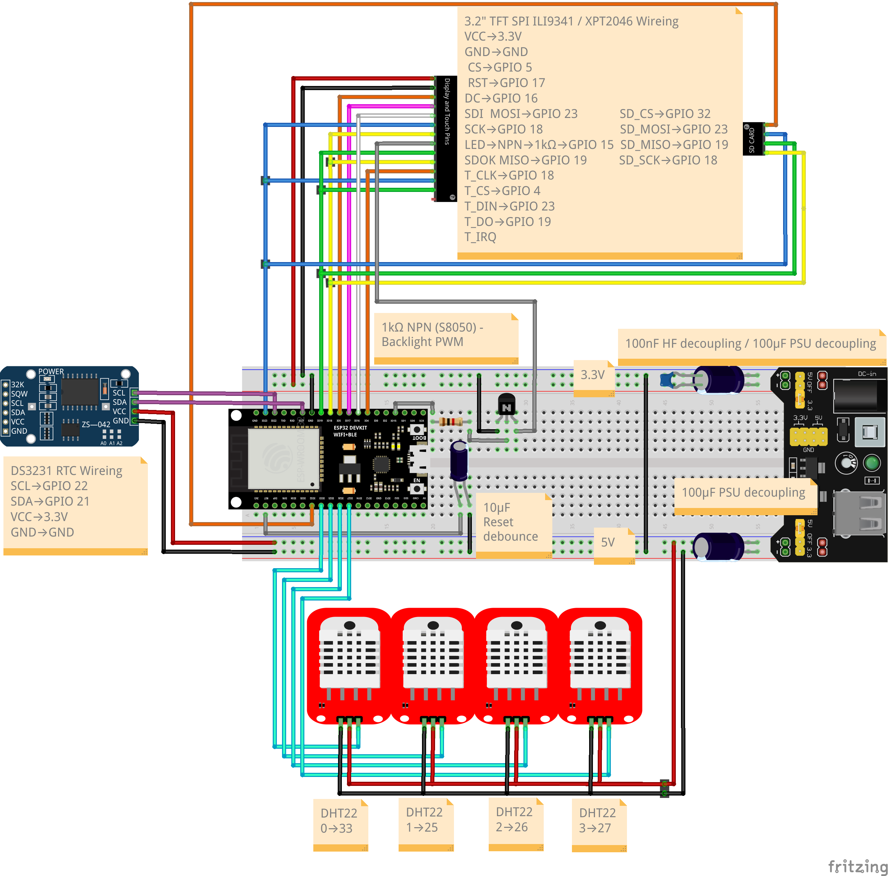

# TerraControl

*Smart terrarium control for those who don't want their setup 
to stop working the day some company decides to shut down their 
servers — and for those who need more than one or two plugs. 
A work in progress measured in years, not sprints, with a parts budget that long surpassed the 
price of the off-the-shelf box, not counting the ones that 
released their magic smoke. And if this accidentally turns out 
to be a solid foundation for a home automation system — well, 
that was definitely not the plan.*


## Roadmap

- [x] Shelly Plug Gen2/3 status retrieval and switching via SHA-256 Digest Auth, identified by MAC address
- [x] DHT22 sensor integration (local, 4 sensors), Soil Moisture Sensor (local 1 sensor) as analog sensor
- [x] Soft-AP — ESP32 as primary AP; Shellys connect directly to ESP32 AP; mDNS replaced by periodic MAC/IP polling via syncApClients
- [x] WiFiWorker — async FreeRTOS task on Core 0 with per-relay mailbox queues, periodic AP sync, and GET_STATUS backoff
- [ ] Remote sensors — ESP32-C3 nodes in light sleep, polled on demand via WiFiWorker
- [ ] RTC (DS3231) — timekeeping with timezone support, DST adjustment, NTP synchronization
- [ ] Switching logic — connect a single sensor value to a Shelly relay, with threshold and time-based rules
- [ ] JSON config layer — serialization/deserialization for all settings; initially hardcoded, later file-backed
- [ ] SD card — load and store configuration as JSON; primary config input mechanism
- [ ] NVS — persist last valid configuration across reboots
- [ ] Onboarding wizard — zero-config binding of new Shellys and C3 sensors from factory reset; automatic MAC registration, credential setup, and security hardening
- [ ] Display *(optional — subject to flash budget; fallback: REST API monitoring + SD card config)*


## Hardware

The following diagram shows the wiring of the MainUnit v1 prototype. 
Depending on the components used, wiring may differ -
particularly for the display module, as variations in pinout 
and layout are common across manufacturers.

The wiring diagram and the hardware list may contain errors. 



*[Download full diagram (PDF)](hardware/TerraControl_MainUnit_V1_bb.pdf)*

## Hardware List

| Component | Description | Quantity |
|---|---|---|
| ESP32 DevKit V1 | ESP32-WROOM-32D, 38-pin | 1 |
| ESP32-C3 Super Mini | Remote sensor node, one per sensor location outside the terrarium | 1 per remote sensor |
| Shelly Plug S | Smart Wi-Fi power plug | 1 - 12 | 
| TFT Display | 3.2" SPI ILI9341 / XPT2046 Touch / SD-Card slot | 1 |
| DS3231 RTC | I²C Real Time Clock with battery backup | 1 |
| LIR2032 | Rechargeable backup battery for DS3231 | 1 |
| DHT22 | Temperature and humidity sensor | 4 |
| Soil Moisture Sensor V 1.2 | Soil Moisture | 1 |
| MB102 | Breadboard power supply 3.3V / 5V | 1 |
| S8050 | NPN transistor, TO-92 | 1 |
| Resistor | 1kΩ | 1 |
| Capacitor | 100nF ceramic (104) | 1 |
| Capacitor | 100µF electrolytic | 2 |
| Breadboard | 830 holes | 2 - 3 |
| Dupont cables | Male-to-Male / Male-to-Female / Female-to-Female | assorted |
| USB cable | Micro-USB, for ESP32 power and flashing | 1 |
| Power supply | 9-12V DC barrel jack, min. 1A | 1 |
| Coffee | Black, strong | ∞ |

## Getting Started

### Prerequisites
- [VS Code](https://code.visualstudio.com/) with 
[PlatformIO](https://platformio.org/) extension
- ESP32 DevKit V1 (ESP32-WROOM-32D) and the full hardware 
setup as described in the Hardware section

### Installation

1. Clone the repository
```bash
   git clone https://github.com/lernenrocks/TerraControl.git
```

2. Copy the WiFi configuration template and fill in your credentials
```bash
   cp wifi_config_example.h wifi_config.h
```

3. Open the project in VS Code with PlatformIO and upload to your ESP32

### Libraries
The following libraries are required and will be installed 
automatically by PlatformIO:
- `northernwidget/DS3231`
- `bodmer/TFT_eSPI`
- `adafruit/DHT sensor library`
- `bblanchon/ArduinoJson`

> **Note:** Library versions may change as development progresses, 
> particularly if LVGL is adopted for the display interface.

## AI Assistance

This project is developed with support from [Claude Code](https://claude.ai/code) (Anthropic). Claude assists with firmware architecture decisions, code reviews, writing and refining unit tests, and keeping the codebase consistent with the project's strict constraints, e. g. no heap allocation, no `HTTPClient`, direct `WiFiClient` usage throughout.

The architectural rules and conventions are maintained in `CLAUDE.md`, which serves as the authoritative reference for the collaboration. Claude works within those boundaries rather than around them.

## Feedback
Questions and feedback are always welcome — feel free to open an issue. 
Please note that this is a hobby project and response times may vary.

## Author
Andy / lernenrocks<br>
[www.lernen.rocks](https://lernen.rocks/)
