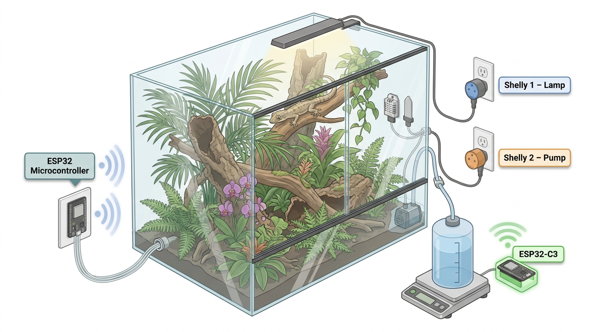

# TerraControl

*Smart terrarium control for those who don't want their setup 
to stop working the day some company decides to shut down their 
servers — and for those who need more than one or two plugs. 
A work in progress measured in years, not sprints, with a parts budget that long surpassed the 
price of the off-the-shelf box, not counting the ones that 
released their magic smoke. And if this accidentally turns out 
to be a solid foundation for a home automation system — well, 
that was definitely not the plan.*

## How It Works



> **Note:** The system overview image is AI-generated (FigureLabs).
> It contains minor technical inaccuracies that survived several
> rounds of prompt engineering before patience and token budget
> ran out simultaneously. It will be replaced by actual photos
> once the prototype is running. If you happen to have a free and
> freely usable image of a terrarium control setup — contributions
> are very welcome.

An ESP32 sits at the heart of the system as the **MainUnit**. It runs its own WiFi access point — Shelly smart plugs connect directly to the ESP32, not to your home router. This keeps all device communication local and independent of cloud services or internet connectivity.

Sensors measure conditions inside the terrarium (temperature, humidity, soil moisture). The MainUnit reads these values and switches the Shellys accordingly — controlling lighting, heating, irrigation, or anything else that plugs into a wall socket.

The ESP32 also connects to your home router as a client, exclusively for time synchronization and future remote access. If your router goes down, the Shellys and sensors remain fully operational.

**Shelly smart plugs** are identified by their MAC address, not by IP. The ESP32 assigns and tracks IPs automatically — no manual configuration required on the network side.


## Roadmap

- [x] Shelly Gen2/3 control — switch on/off, status monitoring, authenticated via SHA-256 Digest Auth
- [x] DHT22 temperature and humidity sensors (4 local), capacitive soil moisture sensor (1 local)
- [x] Soft-AP — ESP32 as primary access point; Shellys connect directly to ESP32, isolated from the home network
- [x] WiFiWorker — dedicated background task handling all network communication with Shellys
- [ ] Remote sensors — ESP32-C3 nodes outside the terrarium, polled on demand
- [ ] RTC (DS3231) — timekeeping with NTP synchronization
- [ ] Switching logic — connect a sensor value to a Shelly, with threshold and time-based rules
- [ ] JSON config layer — serialization/deserialization for all settings
- [ ] SD card — load and store configuration as JSON
- [ ] NVS — persist last valid configuration across reboots
- [ ] Onboarding wizard — zero-config binding of new Shellys and sensors from factory reset
- [ ] Display *(optional — subject to flash budget; fallback: REST API monitoring + SD card config)*


## Hardware

### MainUnit v1 (current)

| Component | Description | Quantity |
|---|---|---|
| ESP32 DevKit V1 | ESP32-WROOM-32D, 38-pin | 1 |
| Shelly Plug S | Smart Wi-Fi power plug, Gen2/3 | 1–8 |
| DHT22 | Temperature and humidity sensor | up to 4 |
| Soil Moisture Sensor V1.2 | Capacitive, corrosion-resistant | 1 |
| MB102 | Breadboard power supply 3.3V / 5V | 1 |
| S8050 | NPN transistor, TO-92 (display backlight) | 1 |
| Resistor | 1kΩ | 1 |
| Capacitor | 100nF ceramic (104) | 1 |
| Capacitor | 100µF electrolytic | 2 |
| Breadboard | 830 holes | 2–3 |
| Dupont cables | Male-to-Male / Male-to-Female / Female-to-Female | assorted |
| USB cable | Micro-USB, for ESP32 power and flashing | 1 |
| Power supply | 9–12V DC barrel jack, min. 1A | 1 |
| Coffee | Black, strong | ∞ |

### Planned / Optional

| Component | Description | Purpose |
|---|---|---|
| ESP32-C3 Super Mini | Remote sensor node | Sensors outside the terrarium, connected via WiFi |
| TFT Display | 3.2" SPI ILI9341 / XPT2046 Touch / SD-Card slot | On-device configuration and monitoring |
| DS3231 RTC | I²C Real Time Clock with battery backup | Timekeeping independent of NTP |
| LIR2032 | Rechargeable backup battery | DS3231 backup power |

The following diagram shows the wiring of the MainUnit v1 prototype.
Depending on the components used, wiring may differ —
particularly for the display module, as variations in pinout
and layout are common across manufacturers.

The wiring diagram and the hardware list may contain errors.


*[Download full diagram (PDF)](hardware/TerraControl_MainUnit_V1_bb.pdf)*


## Getting Started

### Prerequisites
- [VS Code](https://code.visualstudio.com/) with the [PlatformIO](https://platformio.org/) extension
- ESP32 DevKit V1 (ESP32-WROOM-32D) and the hardware described above
- One or more Shelly Gen2/3 smart plugs (Plug S recommended)

### Installation

1. Clone the repository
```bash
git clone https://github.com/lernenrocks/TerraControl.git
```

2. Copy the WiFi configuration template and fill in your credentials
```bash
cp include/wifi_config.h.example include/wifi_config.h
```

3. Open the project in VS Code with PlatformIO and flash it to your ESP32

4. Power on your Shelly plugs. In the Shelly app or web interface, connect each Shelly to the ESP32's access point:
   - SSID: the device name configured in `wifi_config.h` (default: `TerraControl`)
   - Password: `AP_WIFI_PW` from `wifi_config.h`
   
   Once connected, the ESP32 identifies each Shelly by its MAC address and begins monitoring and controlling it automatically.

### Libraries
The following libraries are required and will be installed automatically by PlatformIO:
- `northernwidget/DS3231`
- `bodmer/TFT_eSPI`
- `adafruit/DHT sensor library`
- `bblanchon/ArduinoJson`

> **Note:** Library versions may change as development progresses,
> particularly if LVGL is adopted for the display interface.


## AI Assistance

This project is developed with support from [Claude Code](https://claude.ai/code) (Anthropic). Claude assists with firmware architecture decisions, code reviews, writing and refining unit tests, and keeping the codebase consistent with the project's strict constraints, e.g. no heap allocation, no `HTTPClient`, direct `WiFiClient` usage throughout.

The architectural rules and conventions are maintained in `CLAUDE.md`, which serves as the authoritative reference for the collaboration. Claude works within those boundaries rather than around them.


## Feedback
Questions and feedback are always welcome — feel free to open an issue.
Please note that this is a hobby project and response times may vary.

## Author
Andy / lernenrocks<br>
[www.lernen.rocks](https://lernen.rocks/)
